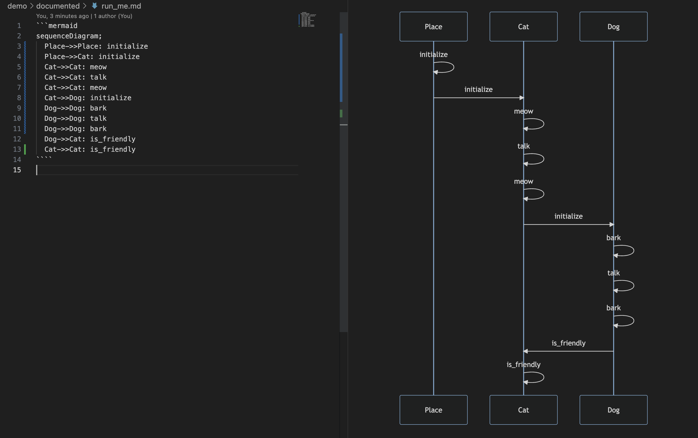

# Documented

<p align="center">
  <a href="https://www.mozilla.org/MPL/2.0/" alt="MPLv2 License">
    
  </a>
  <a href="https://rubygems.org/gems/documented">
    
  </a>
  
  
</p>

**Documented** writes documentation for you, from your tests. Never have out of date documentation again!

Designed to work with https://marketplace.visualstudio.com/items?itemName=bierner.markdown-mermaid for now.

## Usage  

Add `# documented:enable` and `# documented:disable` comments anywhere in your tests:
```ruby
# documented:enable
my_method(do_stuff: true)
# documented:disable
```  

Then run your test via the `documented` CLI like:
```
documented spec/example_spec.rb
```

Documentation will start showing up in the `documented` folder:
<p align="center">
  
</p>

## Installation

In Gemfile add:
```ruby
gem "documented"
```  

In terminal run:
```
bundle install
```

Or:
```
gem install documented
```

## Configuration

```ruby
Documented.configure do |config|
  config.blocklist = {
    'ExampleClass',
  }
end
```

See `Config.rb` for more configuration options.